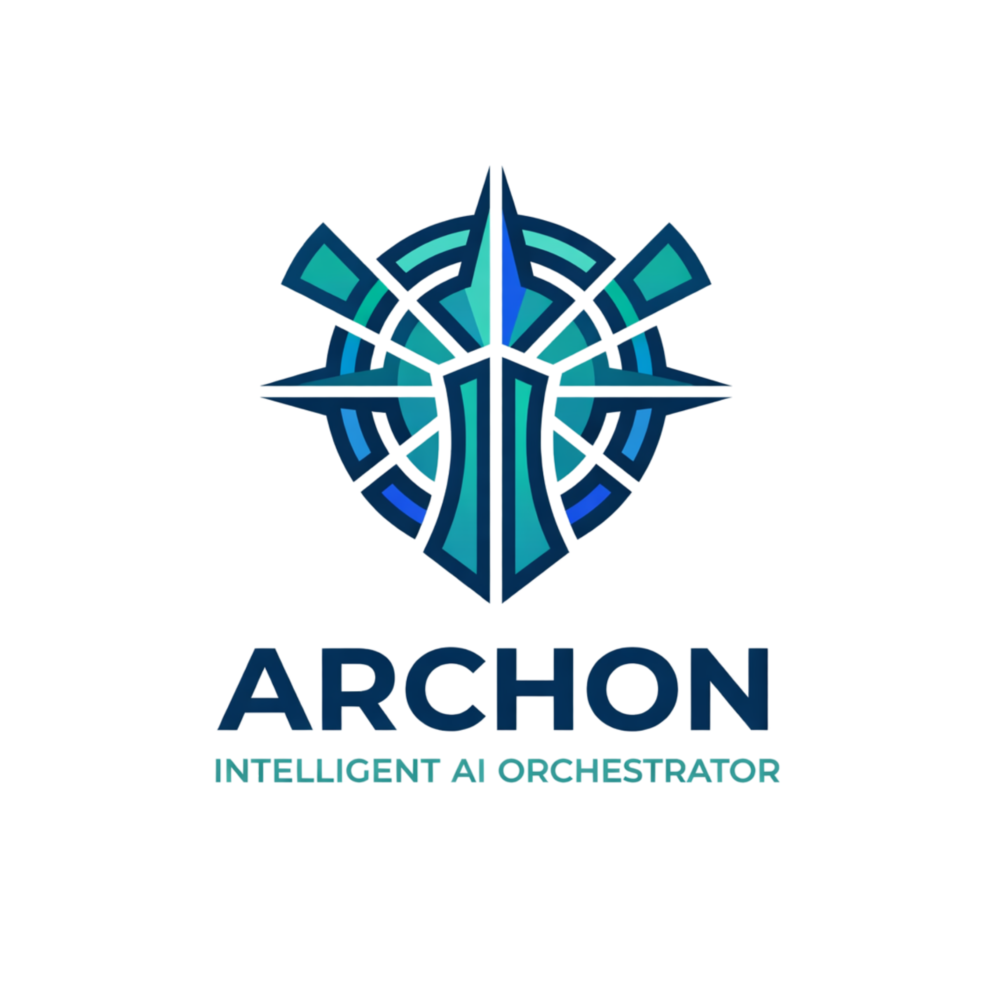

<p align="center">
  
</p>

# Archon — Intelligent Orchestrator for Claude Code

Archon is a scalable agent orchestration framework for Claude Code. It uses Claude Code's native `.claude/` system — agents with frontmatter, skills, commands, and scratchpad — to provide deterministic, multi-agent workflows with proper model tiering and tool scoping.

**Solo mode**: 9 agents for individual developers.
**Team mode**: 21 specialized agents for complex projects.
Security review built in. Specs before code. Clean Architecture enforced.

## How It Works

Use slash commands for structured workflows:

```
/build Add user authentication with JWT
/fix Login endpoint returns 500 on invalid passwords
/review Payment module security audit
/design Database schema for orders system
/data Create Snowflake pipeline for user events
/ml Build a churn prediction model
/refactor Extract auth logic into domain service
```

Or just describe what you need naturally — Archon detects the intent and dispatches the right agents. Use plan mode (`/plan`) for complex features where you want to review the approach before implementation.

### Commands

| Command | Description | Agents |
|---------|-------------|--------|
| `/build` | Full pipeline: classify → analyze → design → spec → security → implement → QA → docs | All (by size) |
| `/review` | Code review + security audit | qa → security |
| `/fix` | Bug analysis, fix, regression test | builder → qa |
| `/secure` | Focused security audit (STRIDE + OWASP) | security (→ architect) |
| `/test` | Test writing and execution | qa |
| `/deploy` | CI/CD, Docker, releases | devops |
| `/design` | Architecture (ADD) + specifications | architect → spec-writer → security |
| `/ml` | ML workflow: problem framing → model → deploy | ml-engineer → security → qa |
| `/data` | Data infrastructure: modeling → schema → pipelines → quality | data → security → qa |
| `/refactor` | Code refactoring with behavioral preservation | architect → builder → qa |

## Quick Start

```bash
# Initialize Archon in your project
npx github:ncacioni/archon init

# That's it. Open Claude Code and use /build, /fix, /review, etc.
```

The `init` command scaffolds `.archon/` (runtime, config, toolkits) and `.claude/` (agents, skills, commands, scratchpad). Then configure permissions — copy Tier 2 into `.claude/settings.local.json` to avoid constant approval popups. See [permission guide](docs/permission-guide.md).

## Solo Mode (Default)

9 agents with model tiering (opus for critical decisions, sonnet for production work):

| Agent | Model | Role |
|-------|-------|------|
| **architect** | opus | Solution design, ADD, C4, API contracts |
| **security** | opus | STRIDE threat modeling, veto power |
| **builder** | opus | Domain logic, app services, adapters (Clean Architecture, TDD) |
| **ml-engineer** | opus | ML systems: features, modeling, evaluation, MLOps |
| **spec-writer** | sonnet | OpenAPI, DB schemas, domain models, wireframes |
| **frontend** | sonnet | Components, UI/UX, accessibility (WCAG 2.1 AA) |
| **qa** | sonnet | Tests, code review, SAST, architecture compliance |
| **devops** | sonnet | CI/CD, observability, releases, documentation |
| **data** | sonnet | Data modeling, pipelines, migrations, warehouse patterns |

### Skills (11 reusable knowledge modules)

Skills provide deep domain knowledge shared across agents:

`clean-architecture` · `security-review` · `spec-templates` · `tdd-patterns` · `backend-patterns` · `ui-ux-patterns` · `mobile-patterns` · `data-patterns` · `devops-patterns` · `ml-engineering` · `mlops-patterns`

## Team Mode (21 Agents)

For larger projects with multiple domains or team members, switch to team mode in `.archon/config.yml`:

```yaml
mode: team
team:
  preset: "full-stack-app"
```

Available presets: `full-stack-app`, `api-service`, `data-platform`, `ml-platform`, `frontend-app`, `minimum-viable`. See [docs/team-presets.md](docs/team-presets.md).

## Runtime

Archon includes a Node.js runtime (ES modules, `js-yaml` as only dependency):

| Module | Purpose |
|--------|---------|
| `project-state.js` | Track feature progress (spec → security → impl → tests → review) |
| `scout-service.js` | OSS package evaluation cache |
| `toolkit-loader.js` | Two-level YAML toolkit loading |
| `maintenance.js` | Toolkit integrity + vulnerability auditing |
| `integrity.js` | Agent/skill/command cross-reference validation |

```bash
cd .archon/runtime && npm install
node --test __tests__/*.test.js
```

37 tests across 5 test suites.

## Core Principles

1. **Security before shipping** — Security agent reviews all implementation work. Has veto power on critical issues.
2. **ADD before code for L/XL features** — Architectural Design Document required for large features. Specs for M+. Inline OK for fixes.
3. **Clean Architecture** — Dependencies point inward: Domain → Application → Adapters. Domain has zero external deps.
4. **Deterministic pipelines** — Commands define exact agent sequences. No more skipped steps.
5. **Progress over ceremony** — Concise status updates after each phase. No gate approvals, no agent labels.

## CI/CD

Archon uses [semantic-release](https://github.com/semantic-release/semantic-release) for automated versioning and releases.

- **Conventional commits** enforced via [commitlint](https://commitlint.js.org/) on PRs
- **Automatic releases** on push to `main` — version bump, changelog, and GitHub release
- Commit format: `type(scope): description` — `feat:` → minor, `fix:` → patch, `BREAKING CHANGE:` → major

```
feat: add user authentication agent        → v1.1.0
fix: correct security veto logic           → v1.0.1
feat!: redesign command pipeline structure  → v2.0.0
```

The devops agent includes semantic-release patterns in its `devops-patterns` skill, available to both `/deploy` (for scaffolding CI/CD) and `/build` (Phase 7: Documentation).

## Repository Structure

```
.claude/
  agents/solo/       9 agents with frontmatter (model, tools, skills)
  agents/team/       21 agents for team mode
  skills/            11 reusable domain knowledge skills
  commands/          10 deterministic workflow entry points
  scratchpad/        Inter-agent state (gitignored, ephemeral)
.github/
  workflows/         release.yml (semantic-release) + commitlint.yml (PR validation)
docs/                Framework documentation
bin/                 CLI (npx github:ncacioni/archon init)
.archon/
  runtime/           5 modules + test suite
  toolkits/          Agent toolkit indices + tool definitions (YAML)
  config.yml         Project configuration
```

## Documentation

| Document | Description |
|----------|-------------|
| [permission-guide.md](docs/permission-guide.md) | Permission tiers for reducing approval friction |
| [team-presets.md](docs/team-presets.md) | Team configurations by project type |
| [spec-templates.md](docs/spec-templates.md) | OpenAPI, DB schema, wireframe templates |
| [QUICKSTART.md](QUICKSTART.md) | Getting started guide |

## License

MIT — see [LICENSE](LICENSE).
